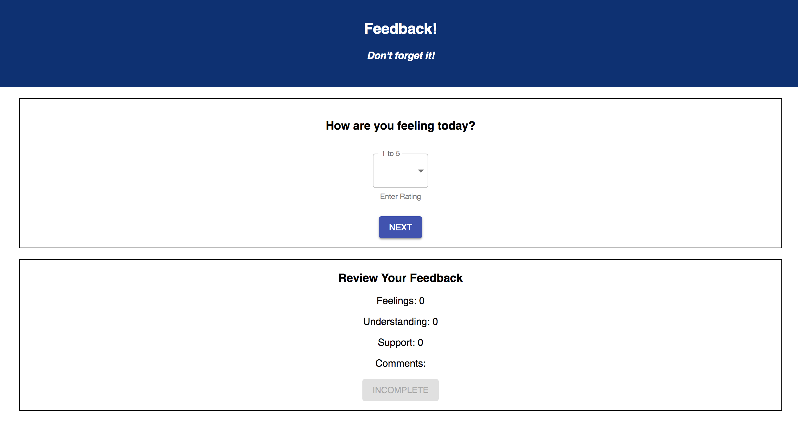
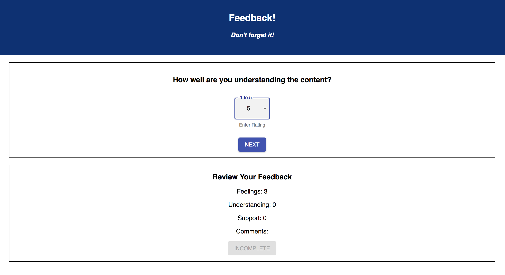
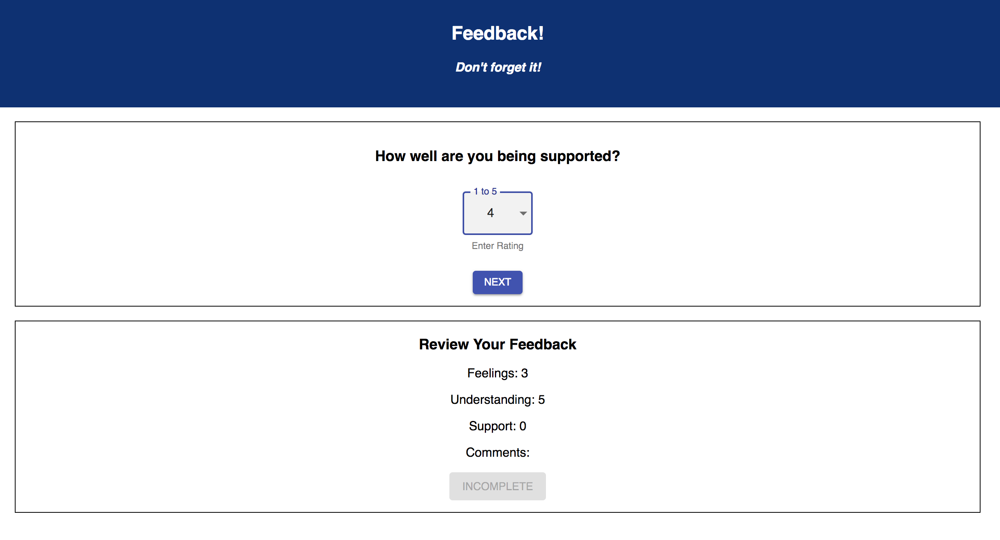
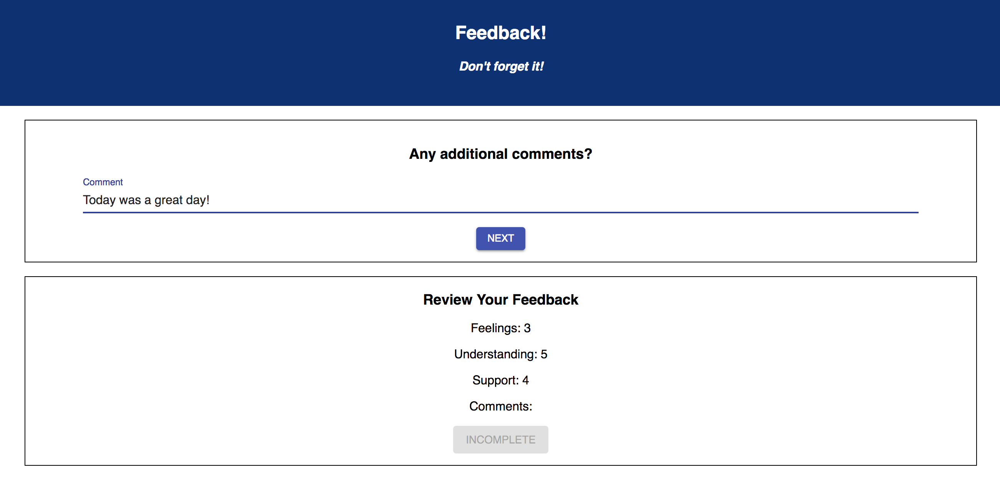
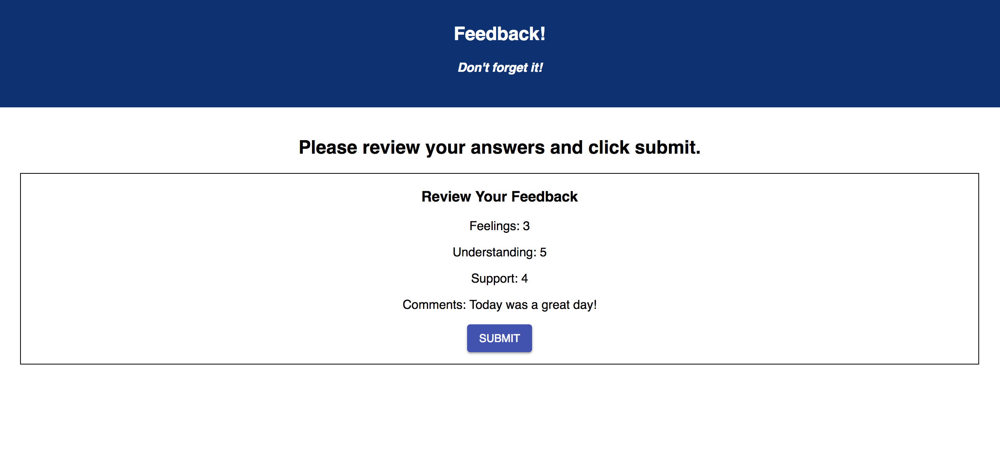
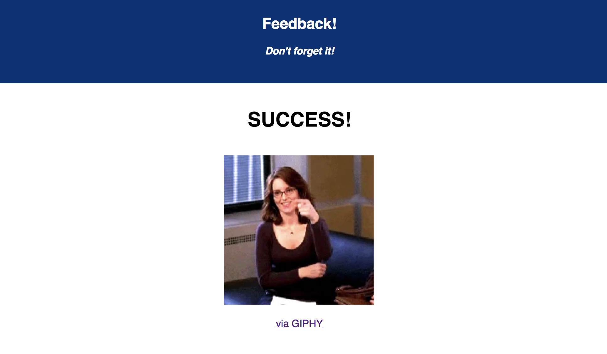
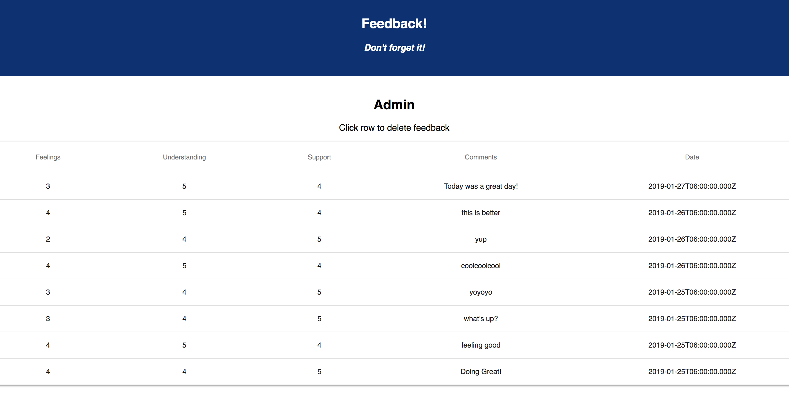

# Redux Feedback Loop

"And my last reminder of the day, which is my last reminder of every day, is...?" - Luke


 This is a feedback form modeled after Prime's system. Feedback will be collected over 4 views, and when all steps are complete, the app will save the feedback in the database. In a separate part of the page, it will display the current feedback values and a submit button. 

### SETUP

Create your database and tables using the provided `data.sql` file. Start the server.

```
npm install
npm run server
```

Now that the server is running, open a new terminal tab with `cmd + t` and start the react client app.

```
npm run client
```

### ADD NEW FEEDBACK

This app uses Redux to store the data across views.

It is a multi-part form that allows users to leave feedback for today. 
There are 4 views for the form parts.
The parts:
- How are you feeling today?

- How well are you understanding the content?

- How well are you being supported?

- Any comments you want to leave?



## THE REVIEW COMPONENT

In addition to the multi-step form, the app displays the results of each step clearly and at all times. 

### Incomplete, Submit button is disabled:


### Survey complete, Submit button is active:



## SUBMIT THE FEEDBACK

The `Review` portion needs a submit button which will be clicked on to actually submit the completed feedback to the server. **This submit button will only be active when all of the survey steps are complete.**

When the submit button is clicked, save the submission in the database. The user should see a submission success page.




### ADMIN SECTION

Display all of the existing feedback at the route `/admin`. The most recently added feedback will appear at the top of the list. The user can delete existing feedback. It will prompt the user to confirm prior to deleting the feedback from the database.



### FUTURE FEATURES

- Add the ability to flag an existing feedback entry for further review on the /admin view
- Deploy the project to Heroku
